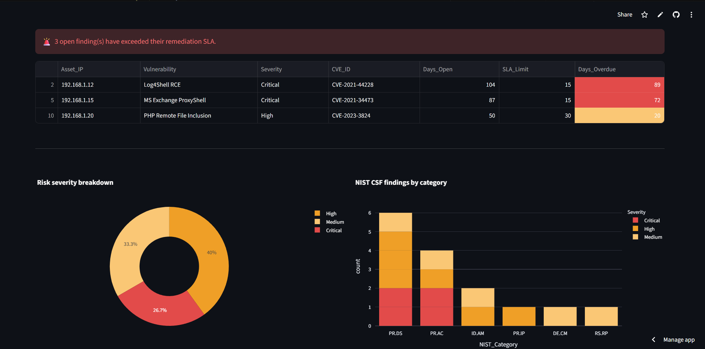

# GRC Risk Dashboard

[](https://darshil-grc-dashboard.streamlit.app)
[](https://python.org)
[](https://streamlit.io)
[](https://www.nist.gov/cyberframework)
[](https://www.iso.org/isoiec-27001-information-security.html)


A live, automated Governance, Risk & Compliance (GRC) dashboard built in Python and Streamlit. Ingests vulnerability scan data, cross-references against the CISA Known Exploited Vulnerabilities (KEV) catalog in real time, calculates weighted risk scores, and tracks remediation performance against industry SLA standards — mapped to both NIST CSF and ISO 27001.

---

## What it does

| Feature | Description |
|---|---|
| CISA KEV cross-reference | Flags any detected CVE that appears on CISA's live Known Exploited Vulnerabilities catalog. Patching is mandated under BOD 22-01. |
| Weighted Risk Score | `Risk_Score = CVSS × Asset_Criticality`. A CVSS 9.8 on a critical production server scores 29.4; the same vuln on a dev box scores 9.8. |
| Risk Heat Map | Interactive Impact vs. Likelihood scatter plot — the standard 5×5 GRC risk matrix. Bubble size encodes CVSS severity. |
| MTTR tracking | Mean Time to Remediate calculated per severity tier, compared against SLA targets (Critical: 15 days, High: 30 days, Medium: 90 days). |
| SLA breach alerts | Active alerts for open findings that have already exceeded their remediation window, with days-overdue counter. |
| Risk trend chart | Month-over-month average CVSS and weighted risk score — shows whether your security posture is improving. |
| NIST CSF coverage | Progress bars showing % of NIST CSF subcategories addressed per function category, plus an overall coverage %. |
| ISO 27001 mapping | Automatic cross-reference of each NIST category to its ISO 27001 Annex A domain. |
| Excel risk register export | One-click download of the full risk register as a formatted Excel file with color-coded severity rows. |

---

## Stack

| Layer | Tool |
|---|---|
| Language | Python 3.10+ |
| Dashboard | Streamlit |
| Charts | Plotly |
| Data | pandas |
| Scanner | python-nmap |
| CVE intel | CISA KEV (live CSV feed) |
| Export | xlsxwriter |

---

## Key metrics produced

- **MTTR — Critical**: avg 9.5 days (SLA: 15 days)
- **MTTR — High**: avg 17.0 days (SLA: 30 days)
- **NIST CSF overall coverage**: 71%
- **ISO 27001 domain coverage**: 43% (6 of 14 Annex A domains)
- **Active SLA breaches**: 3 findings overdue (104, 87, 50 days)
- **CISA KEV matches**: findings cross-referenced against 1,000+ known-exploited CVEs

---

## Project structure

```
GRC-Risk-Dashboard/
├── app.py                  # Streamlit dashboard (all features)
├── scanner.py              # nmap-based vulnerability scanner
├── vulnerabilities.csv     # Scan data with remediation tracking
├── requirements.txt        # Python dependencies
└── README.md
```

---

## Setup & usage

### Prerequisites
- Python 3.10+
- nmap installed on your system (`sudo apt install nmap` on Linux)

### Install

```bash
git clone https://github.com/pateldarshil8/GRC-Risk-Dashboard
cd GRC-Risk-Dashboard
pip install -r requirements.txt
```

### Run the scanner

```bash
# Scan your target (replace with your IP or CIDR range)
python scanner.py --target 192.168.1.0/24
```

This appends findings to `vulnerabilities.csv`. Open the CSV and fill in:
- `Date_Remediated` once a finding is closed
- `Impact`, `Likelihood` (1–5 scale) for risk heat map
- `Criticality` (1=low asset, 2=medium, 3=critical asset)

### Launch the dashboard

```bash
streamlit run app.py
```

---

## Frameworks covered

**NIST Cybersecurity Framework (CSF)**
- ID.AM — Asset Management
- PR.AC — Access Control
- PR.DS — Data Security
- PR.IP — Information Protection Processes
- DE.CM — Security Continuous Monitoring
- RS.RP — Response Planning

**ISO/IEC 27001:2022 Annex A**
- A.8 — Asset Management
- A.9 — Access Control
- A.10 — Cryptography
- A.12 — Operations Security
- A.12.6 — Technical Vulnerability Management
- A.16 — Information Security Incident Management

---

## Resume bullet

> Built a live GRC Risk Dashboard (Python/Streamlit) that ingests vulnerability scan data, enriches findings via CISA KEV cross-reference, and calculates weighted risk scores (CVSS × asset criticality). Tracks MTTR by severity tier (Critical avg: 9.5 days vs. 15-day SLA), flags SLA breaches on open findings, maps 12 vulnerabilities to NIST CSF (71% coverage) and ISO 27001 Annex A, and exports formatted Excel risk registers. Deployed at [darshil-grc-dashboard.streamlit.app](https://darshil-grc-dashboard.streamlit.app).

